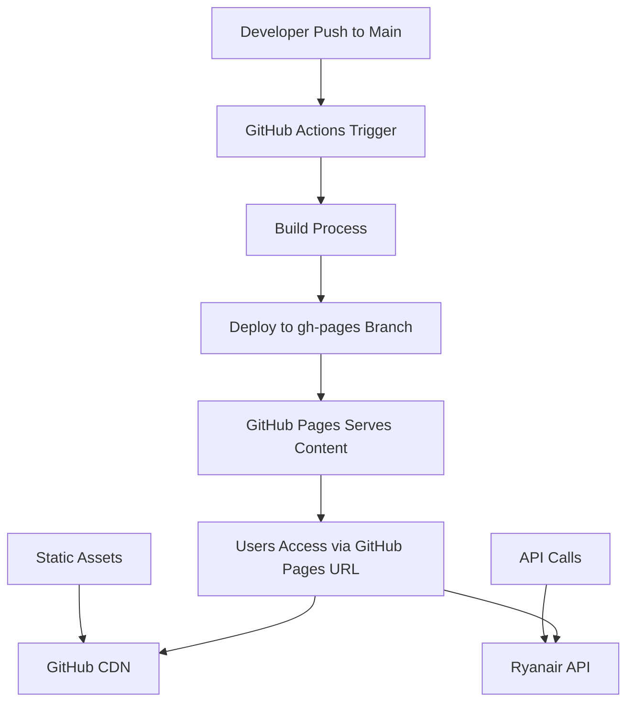

# Design Document

## Overview

The GitHub Pages deployment design leverages GitHub's static site hosting capabilities to serve the Eurotrip Planner application. Since the application is already a client-side only solution using vanilla JavaScript modules, it requires minimal modifications for GitHub Pages compatibility. The design focuses on automated deployment through GitHub Actions, proper asset handling, and ensuring CORS compatibility for API calls.

## Architecture

### Deployment Architecture



### File Structure for GitHub Pages

```
/
├── .github/
│   └── workflows/
│       └── deploy.yml          # GitHub Actions deployment workflow
├── .kiro/                      # Kiro configuration (ignored in deployment)
├── assets/
│   └── styles.css             # Application styles
├── data/
│   ├── airports.json          # Airport data
│   └── routes.json            # Route connections
├── src/
│   ├── api.js                 # API integration
│   ├── main.js                # Application entry point
│   ├── map.js                 # Map functionality
│   └── ui.js                  # UI interactions
├── index.html                 # Main application file
├── package.json               # Project metadata
└── README.md                  # Documentation
```

## Components and Interfaces

### GitHub Actions Workflow

**Purpose**: Automate deployment to GitHub Pages on every push to main branch

**Key Components**:

- Trigger on push to main branch
- Checkout repository content
- Deploy to gh-pages branch using GitHub Pages Deploy Action
- Handle deployment status and error reporting

### Static Asset Handling

**Current Structure**: The application uses ES6 modules with relative imports and external CDN dependencies

**GitHub Pages Compatibility**:

- All relative paths will work correctly on GitHub Pages
- External CDN links (Leaflet.js) will continue to function
- Static data files in `/data` directory will be served correctly

### CORS and API Integration

**Challenge**: GitHub Pages serves content from `https://username.github.io/repository-name/`

**Solution**:

- Ryanair API calls should work from GitHub Pages domain
- Implement proper error handling for potential CORS issues
- Maintain existing fallback mechanisms for API failures

## Data Models

### Repository Configuration

```yaml
# .github/workflows/deploy.yml structure
name: Deploy to GitHub Pages
on:
  push:
    branches: [ main ]
jobs:
  deploy:
    runs-on: ubuntu-latest
    steps:
      - name: Checkout
      - name: Deploy to GitHub Pages
```

### GitHub Pages Settings

```json
{
  "source": "gh-pages branch",
  "customDomain": "optional-custom-domain.com",
  "enforceHttps": true
}
```

## Error Handling

### Deployment Failures

1. **Build Process Errors**
   - GitHub Actions will report specific error messages
   - Previous deployment remains active if new deployment fails
   - Email notifications to repository owner on failure

2. **Asset Loading Issues**
   - Maintain existing error handling in main.js
   - Display user-friendly error messages for failed data loading
   - Graceful degradation if external CDN resources fail

3. **API Connectivity**
   - Existing fallback to distance-based pricing remains active
   - CORS error handling with informative user messages
   - Retry mechanisms for transient API failures

### Runtime Error Handling

```javascript
// Enhanced error handling for GitHub Pages environment
try {
    const { airports, routes } = await initializeData();
    const map = initializeMap(airports, routes);
    initializeUI(airports, map);
} catch (error) {
    console.error('Application initialization failed:', error);
    displayErrorMessage('Unable to load airport data. Please check your connection and try again.');
}
```

## Testing Strategy

### Pre-deployment Testing

1. **Local Development Server**
   - Test application functionality using `npm run start`
   - Verify all modules load correctly
   - Confirm API integration works

2. **GitHub Pages Preview**
   - Test deployment on a feature branch first
   - Verify all assets load from GitHub Pages URL structure
   - Confirm relative paths resolve correctly

### Post-deployment Validation

1. **Automated Checks**
   - GitHub Actions can include basic validation steps
   - Check that index.html returns 200 status
   - Verify critical assets are accessible

2. **Manual Testing Checklist**
   - Map loads and displays airports correctly
   - Search functionality works
   - Route visualization displays properly
   - API calls succeed or fail gracefully
   - Mobile responsiveness maintained

### Performance Considerations

1. **Asset Optimization**
   - Leverage GitHub Pages CDN for fast global delivery
   - Minimize HTTP requests through efficient asset organization
   - Use browser caching for static data files

2. **Loading Performance**
   - Maintain existing lazy loading patterns
   - Optimize initial bundle size
   - Implement progressive enhancement for slower connections

## Security Considerations

1. **API Key Management**
   - No API keys required for current Ryanair integration
   - If future APIs require keys, use GitHub Secrets for build-time injection

2. **Content Security**
   - GitHub Pages serves content over HTTPS by default
   - External CDN resources (Leaflet) use HTTPS URLs
   - No user-generated content to sanitize

3. **Repository Security**
   - Sensitive files (.kiro directory) excluded from deployment
   - No server-side code to secure
   - Public repository appropriate for open-source project
